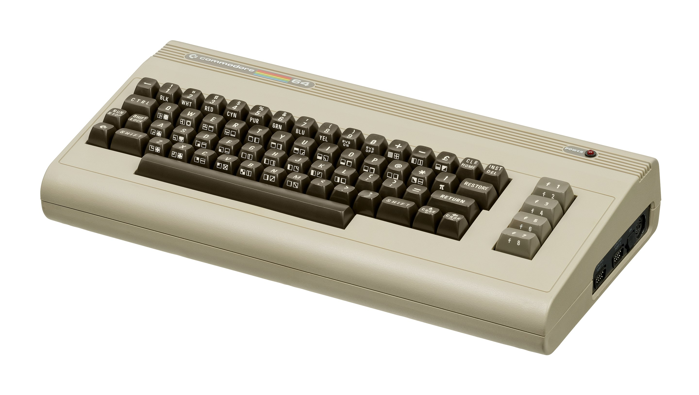
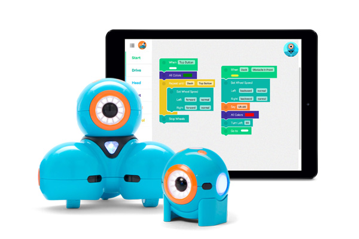
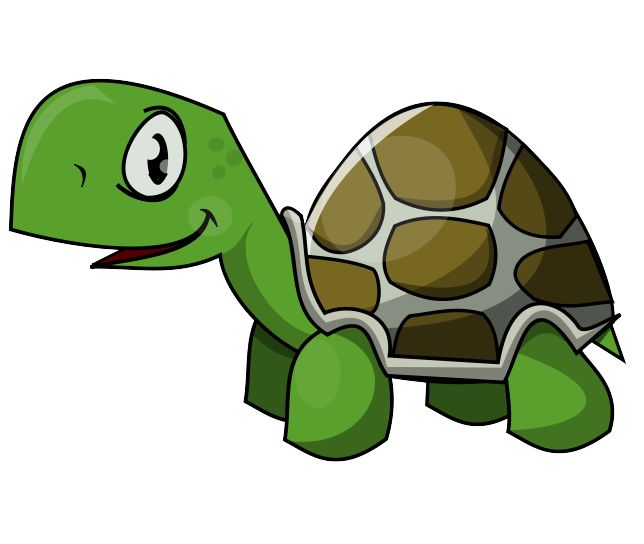
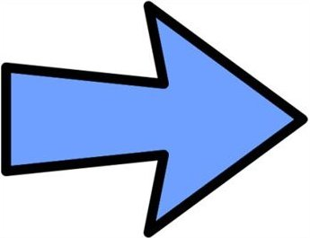
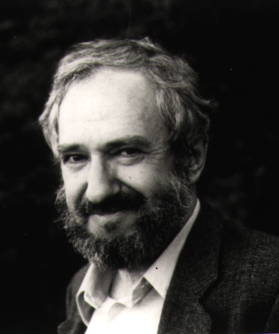

class: center, middle, inverse

# Learning Clojure through Logo

<br><br>


### Elango Cheran, Google
### Timothy Pratley, Outpace

<br>
October 2017<br>
Clojure/Conj <br>
Baltimore, MD<br>

???

@Elango:

I'm Elango, and this is Tim.

I'll be talking about Logo;
Timothy will be talking about combining Logo with a ClojureScript REPL.

This talk presents our personal views, not those of our employers.

---
class: middle, inverse, center

# Learning via Logo

# Logo and Clojure

# Clojure and reach

???

# Overview

This talk will be about:
* why Logo is a compelling learning environment
* how Logo relates to Clojure
* how Clojure can expand its potential audience in surprising ways

---
class: middle, inverse, center

### Act 1:
# Learning via Logo

???

---
background-image:url(../../../img/turtlex.jpg)
background-position: center
background-repeat: no-repeat
background-size: contain

???

* Logo is a programming language to control a robot turtle.
* The turtle is represented as a triangle.
* You send movement commands to the turtle instructing it where to go.
* When the pen is down, wherever the turtle goes, it draws a line.

---
class: middle

<iframe src="index.html#logo" style="width:100%; height:71%">
<div id="app"></div>
</iframe>

???

You can issue commands like

    (right 30)
    (forward 50)
    (left 60)
    (forward 50)
    (back 100)

---

# Logo

     TO STOPSIGN
       FORWARD 200
       LEFT 90
       FORWARD 25
       REPEAT 8 [  RIGHT 45   FORWARD 50  ]
       HOME
     END

---

# Lisp
    
    (TO STOPSIGN
      (FORWARD 200)
      (LEFT 90)
      (FORWARD 25)
      (REPEAT 8 [ (RIGHT 45) (FORWARD 50) ])
      (HOME)
     END)

???

* TODO: make parens bluish
  
---
background-image: url(../../../img/scratch.png)
background-position: center
background-repeat: no-repeat
background-size: contain

???

* TODO: crop out title bar with date

# What's old is new

* Old yet we still use it to teach kids
  - Scratch

---
background-image: url(../../../img/blockly.png)
background-position: center
background-repeat: no-repeat
background-size: contain

???

* Currently many efforts to teach kids programming
  - Blockly
  - Other things based on Blockly (code.org, physical games for kids with coding component)
* You can see the Logo origin
  - Moving character with spatial commands, structuring commands
  - Even in similarity of Blockly blocks <-> Logo code blocks
    * As Lispers, Logo code blocks -> Lisp forms without parens
* Irony:
  - we start our lives in Lisp
  - then program with semi-colons & curly braces
  - then we come back to Lisp

Notes for further reference:

 Insert explanation of Blockly being a Lisp (or at least Lisp-like??)
 - composition of fns
 - HOFs (via nested blocks)
 - regularity of "syntax"
 - lack of explicit types

---
background-image: url(../../../img/drj_vs_lb.jpg)
background-position: center
background-repeat: no-repeat
background-size: contain

---
class: center




???

* BASIC - first language, but wasn't great
  - started in elementary school
  - wanted to program Commodore 64 to do other things
  - took a class at age 10
  - only could learn enough for a guessing game
  - too hard to go further
  - gave up on programming


---

# Logo is interesting

* Easy

--

* Drew what I wanted

--

* Made programming fun

???

TODO: insert drawing an E, and other things

* Logo - I loved learning it:
  - took a class in middle school, at age 11
  - easy to pick up
  - drew random pictures
  - learned how to create more complex pics
    * fns & recursion to assist
  - renewed my interest in programming

---

# What makes Logo interesting

* Easy to learn
* Exploration
* Empowerment

???

# What makes Logo interesting

* Logo is an environment that is:
  - simple
  - interactive
  - visual
* Exploration-based learning often as mode of instruction
  - User learning how to interact & manipulate the environment
  - Gives sense of:
    * self-discovery, excitement, wonder
    * empowerment

---
background-image: url(../../../img/logo-turtle-robot.png)
background-position: center
background-repeat: no-repeat
background-size: contain

???

* Visual nature helps
  - Applies to physical robots too
* Has to be real
* Have to be able to relate to it
* A turtle has personality
* Connect what you do in the computer to the real world
* Garry Walter made a robot
* Robots are relatable
  - sensing objects
  - you can write code to respond to a sensor detecting light.
  - calling code
  - not just about drawing pictures
* Interactivity means more than just one sense, and more than one output

---




???

* Toys following in those footsteps 

---
background-image: url(../../../img/papert.gif)
background-position: center
background-repeat: no-repeat
background-size: contain

???

# Philosophical design

* main goals: interactivity & exploration first & foremost
  - Seymour Papert
    * Knowledge = systems we create, based on existing knowledge systems, to absorb new info
    * Created Logo just as a means to exemplify his theory

---
background-image: url(../../../img/mindstorms.jpg)
background-position: center
background-repeat: no-repeat
background-size: contain

???

* Mindstorms

---
class: middle, inverse, center

### Act 2:
# Logo in Clojure

---

# Learning Clojure

* Best book?
* Setup
* Abstract
* Lexicomania

???

# Show, then tell -- but now in Clojure

* Elango's story of learning Clojure
  - Didn't know which reference resource to use
  - Didn't feel comfortable setting up environment in CLI
  - Reading about seqs, data structures, and core fns felt abstract
  - Fns like learning Unix CLI tools - don't know the perfect tool unless you already know it
  - Have to keep bashing your head against a wall until you learn it all
* Meanwhile, Logo is also a Lisp

---

# Learning Clojure





    [com.google/clojure-turtle "0.3.0"]

???

* clojure-turtle
  - Bring Logo to Clojure
  - Help make learning Clojure easier

---


???

Here are some screenshots

---

# Prior art

- Logo in Clojure
  * Nurullah Akkaya - https://nakkaya.com/2010/01/09/a-simple-turtle-graphics-implementation-in-clojure/
  * rm-hull/turtle
  * japonophile/clogo
  
- Logo in the browser
  * MIT App Inventor
  * Scratch / code.org / etc.
  * Physical programming-related toys with Blockly-based sw component

???

# Different focus

  * Blurring the lines between Logo and Clojure
  * Blurring the lines between Turtle and Programming

---
class: middle, inverse, center

### Act 3:
# Clojure and Reach

???

@ Timothy

* Has anyone here had a similar experience to Elango learning Clojure?
* I know I did.
* What about trying to introduce someone to Clojure?

---


???

* My friend Nathan came up to me last year and said:
  - "I'm ready to give Clojure a try, I've even installed Emacs!"
* You can probably guess where this is going right?

---


???

* I said:
  - "Awesome! Clojure is so cool. First we need some other stuff..."

---


???

* Install Java
* Get Leiningen
* Make a project
* Add these dependencies
* Let's talk about the namespace syntax so you can use those dependencies
* Don't press ctrl z in emacs!

---


???

* It's frustrating dealing with new tools when we just want to write code.

---

# Getting started is hard

???

* Getting started is hard right? Well, not any more!

---

# Getting started is ~~hard~~ easy!


???

* All that changed last year with the arrival of ClojureScript REPLs

---

# Getting started is ~~hard~~ easy!


<br>
<br>
.center[


<br>

.large[http://timothypratley.github.io/power-turtle]
]

???

* Now you can compile and Evaluate ClojureScript in the browser
* All you need to get coding is a URL
* ClojureScript has reach, anyone can access it
* I'd been talking with Elango about teaching Clojure through Logo 
  - and we thought, what if we marry turtle with a ClojureScript REPL

---

<iframe src="index.html" style="width:100%; height:100%">
<div id="app"></div>
</iframe>

???

* This is Power Turtle; a batteries included REPL
* The first lessons gets you started with Logo commands
* In freestyle mode you can choose from several canvases:
  - Turtle
  - Raster canvas; another drawing system based on pixels
    * good for illustrating sequences to make patterns
    * can create Conway's game of life
  - Quil is a more comprehensive drawing system  
  - The HTML canvas let's you create HTML elements.
    * h1
    * buttons
    * inputs
    * You can put SVG in here.
    * You could build a game like Tetris here.  
* We want learners to transcend Logo
  - into other interesting things
  - in Clojure

Let's take a closer look at one of the lessons

* Lesson 1
* triangle
* square
* offset square
* param for octagon
* Can anyone describe how to draw a circle?
* concentric circles
* spirals
  - like circles, like concentric circles...
  - how can you move from small to large?

```
    (defn step [x]
      (forward x)
      (right 30))
```
  - Sequences needed for incremental increase in distance travelled
```
    (range 10)
    (map step (range 10))
```
  - Because this is a REPL we don't need to explain laziness yet
  - But we can already talk about modifying a sequence 
```
    (defn exp [x]
      (* x x 0.1))
    (map exp (range 40))
    (map step (map exp (range 40)))
```    

* We're writing Clojure.
* There is a canvas where we can see a product of our efforts
* There are lessons to guide beginners through core concepts
* Each concept suggests examples to try
* There is a progression of concepts...
  - call a function
  - combine functions into new functions
  - repeat functions
  - create sequences
  - and modify sequences

---
background-image: url(../../../img/blockly-nested-blocks.png)
background-position: center
background-repeat: no-repeat
background-size: contain

# Show, then tell

???

# Show, then tell

* Functions/HOF were the hard part for beginner students
  - Problems occur when explaining before internalization
  
* From our experience:
  - Show first, encourage practice, then explain
  - just show them fn & repeat
    - They get it.
  - In Blockly, repeat (HOF) is made by nested blocks inside a block

---
class: center

# Explaining too early can hurt



???

@ Elango

  - Papert:  visual and interactive is necessary but not sufficient.  new info must relate to existing knowledge.

* Progression becomes impt
  - Introducing `map` first - introduce seqs and transforming seqs
  - Introducing `range` first - introduce seqs

* Logo has a simple & small set of primitives
* Logo lets people internalize a computation model that is simple and expressive.
* This model also translates very well to Clojure.
* We’re trying to make that bridge strong.
* The focus is on learning useful programming concepts

---

# Lessons are text files

## lesson1.md

    canvas: turtle

    Hi!

    In this lesson you will be sending commands to a robot turtle,

    ---

    Type this command into the text area:

        (forward 50)

## Direct link your own lesson

http://timothypratley.github.io/power-turtle#lessons.red[//server.org/my-lesson.md]

???

* Perhaps you have a lesson in mind that you want to teach?
* Good news! Lessons are markdown text files
* Markdown is very easy to edit
* Your Markdown can be loaded remotely by url
  - you can deliver your own lesson with a link
  - you don't need us to do anything
* Please contribute lessons so that we can link to them in the lesson list
  - just send us the markdown and we'll include it
* As an educator, you get to decide what lessons are best for your situation

---
class: middle

.large[

> _“It was quite astounding how Noah went off on his own tangent to draw his own patterns about half way through the lesson!”_

]

???

@ Timothy

Here is some feedback I received about the existing lessons:

> “It was quite astounding how Noah went off on his own tangent to draw his own patterns about half way through the lesson!”

* This is exactly what I had hoped for.
* Lessons are guides, but you can really do whatever you want.
* The emphasis is on self discovery.
* See if you can figure out how to do X.

---
background-image: url(../../../img/korean.jpg)
background-position: center
background-repeat: no-repeat
background-size: contain

???

* In other news...
* I'm currently learning Korean
  - fascinating culture and language.
* The writing system is unique in that it was designed for literacy,
  unlike most other writing systems.
* The characters are actually very logical, but learning the vocabulary is still hard.
* Alex - friend from Korea - "How did you learn programming?"
  - "I learnt English. Then I went to an Australian University. Now I work at Microsoft."
* Sounds easy, but that's a decade of dedication
* It's hard to imagine how long it would be before I could code in Korean
* Only 5% of the world speaks English as their first language.
* 20% if you include non-native speakers.
* For most people who want to learn programming, the answer is:
  "Awesome! Go learn English first."
* But I knew Elango had translated Clojure to Thamil and I wondered if we could do that for other languages too

---

<iframe src="index.html" style="width:100%; height:100%">
<div id="app"></div>
</iframe>

???

* And of course we can!

# Demo - "Polyglot Clojure"

    (앞으로 50)
    
    (권리 90)

* Thamil example - forward and turning
* German example - repeat/repeatedly 3 to form a square
* Wow Elango, you are quite the polyglot programmer!

---
background-image: url(../../../img/etower.jpg)
background-position: center
background-repeat: no-repeat
background-size: contain

# Parlez vous Clojure?

???

# Parlez vous Clojure?

* I'm pretty sure Clojure is a French word right?
* I think it's strange but Elango and I hear a common response to programming in another language;
  "They're going to have to learn English anyway."
* That’s missing something that I want to point out: Translations are great!
  - I'm sure you know geometry... it’s Greek! Someone translated it for you.
  - Astronomy? Latin
  - Einstein’s work? German
  - Marie Curie’s work? French
  - Translations are just plain useful  
  - They are also super easy in Clojure, almost no effort, so why not?

---

# Thamil

    [clj-thamil "0.2.0"]

???

Elango had already translated Thamil and released a library called clj-thamil:
  * It works great in Clojure
  * It relies on macro-writing macros, which does not work in ClojureScript
  * So we made something new

---
      
# Clojure By Another Name

> _What's in a name? that which we call a rose<br>
  By any other name would smell as sweet;<br><br>
  -- Romeo and Juliet (William Shakespeare)_
  
      [lein-cban "0.1.0"]
      [cban "0.1.0"]
  
???

Clojure By Another Name, or CBAN for short.

* lein-cban creates translation wrappers
  - you can use it translate libraries of code
* cban has several translations of clojure.core
* Works in ClojureScript
* Generated wrappers work better with IDEs than var importing
  - You can navigate to definitions, get docstrings, and arity
  
---
  
# Translations are text files
  
    existing,alias,docstring,comment
    forward,앞으로
    back,뒤로
    right,권리
    left,왼쪽
  
???

* Translations are CSV text files
  - you don't have to be a programmer to contribute

---
background-image: url(../img/bad-idea.jpg)
background-position: center
background-repeat: no-repeat
background-size: contain

???

* Let's get everyone in the world learning Clojure.
* This will be great right?

---

## Dear Tim

    ERROR - Cannot read property 'call' of undefined

Not sure what I am doing<br>
Love Mum

???

* Here is one aspect of Power Turtle that did not work out very well...

Dear Tim

    ERROR - Cannot read property 'call' of undefined

Not sure what I am doing, Love Mum

* This is the error message you get when you typo a function call
  - we can reach a larger audience if we can find a way to improve this
  - good error messages are helpful to everybody, not just beginners

---

# ClojureScript REPLs

## Klipse

Blogs, website, documentation


## Replumb

More effort, more control

???

* Perhaps you are interested in building something like Power Turtle yourself.
* Here's how you could go about it:

If you want to embed a ClojureScript REPL on your blog or website,

* Klipse provides a really easy way to do this
  - just include the klipse script and any code blocks become editable
    * users appreciate it
    * its easy!

* Replumb is what Power Turtle uses as a REPL
  - Takes more effort, and provides more control
  
Power Turtle puts Replumb and Turtle together.

---
class: middle, inverse

# Learning Clojure through Logo

1. Easy to get started (nothing to install)
2. Fun (it's Logo)
3. Learn programming through Logo
4. in Clojure
5. Transcend Logo into Clojure

???

Which brings us back to Learning Clojure through Logo...

Clojure can be a great beginners language.

We've built a programming experience in Power Turtle that is:
* Easy to get started - nothing to install
* Delivers the fun of Logo
* Has a clear progression of concepts to learn
* Blurs the boundaries of Logo into Clojure

---

# Acknowledgements

* Maria Geller - Bootstrap ClojureScript contributions and advocacy
* Mike Fikes - Patiently helping use overcome hurdles
* Andrea Richiardi - Replumb
* Yehonathan Sharvit - KLIPSE
* Nikita Beloglazov - Quil 
* Neil Fraser - Blockly
* David Nolen - ClojureScript lead
* Rich Hickey - Creator of Clojure

???

These people helped us greatly.

@ Elango

---

# Links

* Power Turtle - https://timothypratley.github.io/power-turtle
* clojure-turtle - https://github.com/google/clojure-turtle
* CBAN - https://github.com/timothypratley/cban
* Blockly - https://developers.google.com/blockly/

# Contact
 
- Elango Cheran: elango.cheran@gmail.com
- Timothy Pratley: timothypratley@gmail.com

### Comments / suggestions / contributions welcome!

???

---
class: middle, inverse

# Thanks

???

@ Elango & Timothy

* Any Questions?
