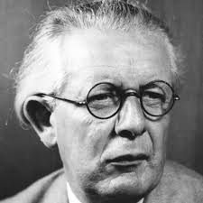

class: center, middle, inverse

# Learning Clojure through Logo

<br><br>


### Elango Cheran, Google
### Timothy Pratley, Outpace

<br>
October 2017<br>
Clojure/Conj <br>
Baltimore, MD<br>

???

@Elango:

I'm Elango, and this is Tim.

I'll be talking about Logo;
Timothy will be talking about combining Logo with a ClojureScript REPL.

This talk presents our personal views, not those of our employers.

---
class: middle, inverse

# Overview

* Learning via Logo
* Logo and Clojure
* Clojure and reach

???

# Overview

This talk will be about:
* why Logo is a compelling learning environment
* how Logo relates to Clojure
* how Clojure can expand its potential audience in surprising ways

---
class: middle, inverse, center

### Act 1:
# Learning via Logo

---

# Logo is interesting

???

Basic wasn't great

I loved learning Logo

---

# Logo is interesting

* Interactive
* Self discovery
* Wonder
* Empowerment

???

# What makes Logo interesting

* Sense of empowerment, wonder, and self discovery
* Learning how to manipulate the environment, interact with the environment.


---
background-image: url(../../../img/mindstorms.jpg)
background-position: center
background-repeat: no-repeat
background-size: contain

???

# Philosophical design

* interactivity-first and exploration-first goals
  - Piaget - theory of knowledge as systems we create to absorb new info
  - Papert
    * Student of Piaget
    * Expanded theory - knowledge = systems we create, based on existing knowledge systems, to absorb new info
    * Created Logo just as a means to exemplify his theory

* Mindstorms

---
background-image: url(../../../img/logo-drawing-example.png)
background-position: center
background-repeat: no-repeat
background-size: contain

???

# What is Logo

* Turtle (triangle) carrying a pen and moving around in a graphics canvas
* draws lines as it moves

---
background-image: url(../../../img/logo-turtle-robot.png)
background-position: center
background-repeat: no-repeat
background-size: contain

???

... add picture of robot

... show logo code

... mark up logo code as lisp

# More on design of Logo

* Visual nature helps
  - Applies to physical robots too
* Logo is dialect of Lisp
  - ... expand on this
  
---
background-image: url(../../../img/scratch.png)
background-position: center
background-repeat: no-repeat
background-size: contain

???

# What's old is new

* Old yet we still use it to teach kids
  - Scratch

---
background-image: url(../../../img/blockly.png)
background-position: center
background-repeat: no-repeat
background-size: contain

???

  - Blockly
  - Other things based on Blockly (code.org, physical games for kids with coding component)

Similarity of Lisp / Logo code & Blockly blocks

There's something familiar about the regularity and simplicity
of blocks for Lispers. <--  That may be more novel for ppl from
 curly brace languages.

 Insert explanation of Blockly being a Lisp (or at least Lisp-like??)
 - composition of fns
 - HOFs (via nested blocks)
 - regularity of "syntax"
 - lack of explicit types
 
We start our lives in lisp, then program with semi-colons, then come back to lisp

---

# Show, then tell

???

# Show, then tell

... add blockly pic of block inside another

* Functions/HOF were the hard part for beginner students
  - Problems occur when explaining before internalization
  
* From our experience:
  - Show first, encourage practice, then explain
  - just show them fn & repeat
    - They get it.
  - In Blockly, repeat (HOF) is made by nested blocks inside a block

---
class: middle, inverse, center

### Act 2:
# Logo in Clojure

---

# Learning Clojure


???

# Show, then tell -- but now in Clojure

* Elango's story of learning Clojure
  - Didn't know which reference resource to use
  - Didn't feel comfortable setting up environment in CLI
  - Reading about seqs, data structures, and core fns felt abstract
  - Fns like learning Unix CLI tools - don't know the perfect tool unless you already know it
  - Have to keep bashing your head against a wall until you learn it all
* Meanwhile, Logo is also a Lisp

---

# Learning Clojure


->


    [com.google/clojure-turtle "0.3.0"]

---


???

* clojure-turtle
  - Bring Logo to Clojure
  - Help make learning Clojure easier

---

# Prior art

- Logo in Clojure
  * Nurullah Akkaya - https://nakkaya.com/2010/01/09/a-simple-turtle-graphics-implementation-in-clojure/
  * rm-hull/turtle
  * japonophile/clogo
  
- Logo in the browser
  * MIT App Inventor
  * Scratch / code.org / etc.
  * Physical programming-related toys with Blockly-based sw component

???

# Different focus

  * Blurring the lines between Logo and Clojure
  * Blurring the lines between Turtle and Programming

---
class: middle, inverse, center

### Act 3:
# Clojure and Reach

???

@ Timothy

* Has anyone here had a similar experience to Elango learning Clojure?
* I know I did.
* What about trying to teach someone else?

---


???

* My friend Nathan came up to me last year and said:
  - "I'm ready to give Clojure a try, I've even installed Emacs!"
* You can probably guess where this is going right?

---


???

* I said:
  - "Awesome! Clojure is so cool. First we need some other stuff..."

---


???

* Install Java
* Get Leiningen
* Make a project
* Add these dependencies
* Let's talk about namespaces, laziness, higher order functions, persistence
* Don't press ctrl z in emacs!

---


???

* It's frustrating.
* We just want to write code.

---
class: middle

# Getting started is hard

???

* Getting started is hard right? Well, not any more!

---
class: middle

# Getting started is ~~hard~~ easy!

???

* All that changed last year with the arrival of ClojureScript REPLs
* Now you can compile and Evaluate ClojureScript in the browser
* All you need to get coding is a URL
* ClojureScript has reach, anyone can access it
* I'd been talking with Elango about teaching Clojure through Logo 
  - and we thought, what if we marry Clojure turtle with an in browser REPL

---

<iframe src="index.html" style="width:100%; height:100%">
<div id="app"></div>
</iframe>

???

@ Timothy

This is Power Turtle.

* forward
* right
* defn zig
* repeat zig
* Add commands to the action bar
  - buttons are just functions.
* spirals
  - like circles
```  
    (defn step [x]
      (forward x)
      (right 30))
```   
  - Sequences needed for incremental increase in distance travelled
```  
    (range 10)
    (map step (range 10))
```
  - Because this is a REPL we don't need to explain laziness yet
  - But we can already talk about modifying a sequence 
```       
    (defn exp [x]
      (* x x 0.1))
    (map exp (range 40))
    (map step (map exp (range 40)))
```    

* We're writing Clojure.
* There is a canvas where we can see a product of our efforts
* There are lessons to guide beginners through core concepts
* Each concept suggests examples to try
* There is a progression of concepts...
  - call a function
  - combine functions into new functions
  - repeat functions
  - create sequences
  - and modify sequences

---
class: center

# Explaining too early can hurt




"Interactive!" -- "Progression!"

???

@ Elango

* Hypothetical scenario
  - Piaget:  let’s create FP knowledge systems based on visual Turtle
  - Papert:  visual and interactive is necessary but not sufficient.  new info must relate to existing knowledge.

* Progression becomes impt
  - Introducing `map` first - introduce seqs and transforming seqs
  - Introducing `range` first - introduce seqs

Logo lets people internalize a computation model that is simple and expressive. This model also translates very well to Clojure. We’re trying to make that bridge strong.
Using Quil requires learning more new information, more concepts than we can relate to. Logo requires less to talk about things like sequences.

Logo designed with simple & small set of primitives

what's wrong with Quil-like env - the focus isn't on learning concepts, instead gets tangential into graphics/animation domain

---
class: middle

.large[

> _“It was quite astounding how Noah went off on his own tangent to draw his own patterns about half way through the lesson!”_

]

???

@ Timothy

Here is some feedback I received from a Power Turtle user:

> “It was quite astounding how Noah went off on his own tangent to draw his own patterns about half way through the lesson!”

* This is exactly what I had hoped for.
* Lessons are guides, but you can really do whatever you want.

---

<iframe src="index.html" style="width:100%; height:100%">
<div id="app"></div>
</iframe>

???

In freestyle mode you can choose from several canvases:
* Turtle which we've seen
* Raster canvas is another drawing system based on pixel setting
  - good for illustrating sequences to make patterns
  - can create Conway's game of life
* Quil is a more comprehensive drawing system
  - turtle is actually implemented in Quil
* The HTML canvas let's you create HTML elements.
  - h1
  - buttons
  - inputs
  - You can put SVG in here.
  - You could build a game like Tetris here.  
* We want learners to transcend turtle
  - into other interesting things
  - in Clojure
* Perhaps you have a lesson in mind that you want to teach?

---

# Lessons are text files

## lesson1.md

    canvas: turtle

    Hi!

    In this lesson you will be sending commands to a robot turtle,

    ---

    Type this command into the text area:

        (forward 50)

## Direct link your own lesson

http://power-turtle//#lessons//my-host.com/lesson1.md

???

* Good news! Lessons are markdown text files
* Markdown is very easy to edit
* Your Markdown can be loaded remotely by url
  - you can deliver your own lesson with a link
  - you don't need us to do anything
* Please contribute lessons so that we can link to them in the lesson list
  - just send us the markdown and we'll include it
* As an educator, you get to decide what lessons are best for your situation

---
background-image: url(../../../img/korean.jpg)
background-position: center
background-repeat: no-repeat
background-size: contain

???

* In other news...
* I'm currently learning Korean
  - fascinating culture and language.
* The writing system is unique in that it was designed for literacy,
  unlike most other writing systems.
* The characters are actually very logical, but learning the vocabulary is still hard.
* Alex - friend from Korea - "How did you learn programming?"
  - "I learnt English. Then I went to an Australian University. Now I work at Microsoft."
* Sounds easy, but that's a decade of dedication
* It's hard to imagine how long it would be before I could code in Korean
* Only 5% of the world speaks English as their first language.
* 20% if you include non-native speakers.
* For most people who want to learn programming, the answer is:
  "Awesome! Go learn English first."
* But I knew Elango had translated Clojure to Thamil and I wondered if we could do that for other languages too

---

<iframe src="index.html" style="width:100%; height:100%">
<div id="app"></div>
</iframe>

???

* And of course we can!

# Demo - "Polyglot Clojure"

    (앞으로 50)
    
    (권리 90)

* Thamil example - forward and turning
* German example - repeat/repeatedly 3 to form a square
* Wow Elango, you are quite the polyglot programmer!

---

# Parlez vous Clojure?

???

# Parlez vous Clojure?

* I'm pretty sure Clojure is a French word right?
* I think it's strange but Elango and I hear a common response to programming in another language;
  "They're going to have to learn English anyway."
* That’s missing something that I want to point out: Translations are great!
  - I'm sure you know geometry... it’s Greek! Someone translated it for you.
  - Astronomy? Latin
  - Einstein’s work? German
  - Marie Curie’s work? French
  - Translations are just plain useful  
  - They are also super easy in Clojure, almost no effort, so why not?

---

# Thamil

    [clj-thamil "0.2.0"]

???

Elango had already translated Thamil and released a library called clj-thamil:
  * It works great in Clojure
  * It relies on macro-writing macros, which does not work in ClojureScript
  * So we made something new

---
      
# Clojure By Another Name

> What's in a name? that which we call a rose<br>
  By any other name would smell as sweet;<br>
  -- Romeo and Juliet (William Shakespeare)
  
      [lein-cban "0.1.0"]
      [cban "0.1.0"]
  
???

Clojure By Another Name, or CBAN for short.

* lein-cban creates translation wrappers
  - you can use it translate libraries of code
* cban has several translations of clojure.core
* Works in ClojureScript
* Generated wrappers work better with IDEs than var importing
  - You can navigate to definitions, get docstrings, and arity
  
---
  
## Translations are text files
  
    existing,alias,docstring,comment
    forward,앞으로
    back,뒤로
    right,권리
    left,왼쪽
  
???

* Translations are CSV text files
  - you don't have to be a programmer to contribute

---
background-image: url(../img/bad-idea.jpg)
background-position: center
background-repeat: no-repeat
background-size: contain

???

* Let's get everyone in the world learning Clojure.
* This will be great right?

---

## Dear Tim

    ERROR - Cannot read property 'call' of undefined

Not sure what I am doing<br>
Love Mum

???

Here is one aspect of Power Turtle that did not work out very well...

This is an email I received:

Dear Tim

    ERROR - Cannot read property 'call' of undefined

Not sure what I am doing, Love Mum

* This is what you get when you typo a function call.
* To contrast, this is what an error looks like in ELM

---

    -- NAMING ERROR -----------------

    Cannot find variable `List.nap`

        div [] (List.nap viewUser users)
                ^^^^^^^^

    `List` does not expose `nap`. Maybe you want one of the following?

        List.map
        List.any
        List.map2
        List.map3

???

* This message has a category; it is a naming error.
* It specifies the variable it could not find.
  - very helpful for typoes and data shape mistakes
* It shows me the line and indicates exactly where the error is.
  - that's the part I find most helpful
* The message is neatly formatted with plenty of whitespace.
* It even goes the extra mile to give some helpful suggestions.
* I make a lot of mistakes every day.
* As a heavy Clojure user I would benefit far more than my Mum would from this style of error reporting.
* Good error messages are good for beginners
  - and good error messages are helpful to everybody

---

# ClojureScript REPLs

## Klipse

Blogs, website, documentation

## Replumb

More effort, more control

    (+ Replumb Turtle)   
    => PowerTurtle

???

If you want to embed a ClojureScript REPL on your blog or website,

* Klipse provides a really easy way to do this
  - just include the klipse script and any code blocks become editable
    * users appreciate it
    * its easy!

* Replumb is what Power Turtle uses as a REPL
  - Takes more effort, and provides more control
  
Power Turtle puts Replumb and Turtle together.

---
class: middle, inverse

# Learning Clojure through Logo

* Easy to get started (just a url)
* Fun to interact with (it's Logo)
* Learn programming through Logo
* in Clojure
* Transcend Logo into Clojure

???

Which brings us back to Learning Clojure through Logo...
* It is easy to get started (just a url)
* Logo is fun. It gives learners a sense of empowerment, wonder and discovery.
* Logo has a clear progression of concepts.
* We want to deliver that in Clojure.
* And set them on a path to transcend from Logo into Clojure.
* We hope they will have fun and build interesting things along the way.

---

# Acknowledgements

* Maria Geller - Bootstrap ClojureScript contributions and advocacy
* Mike Fikes - Patiently helping use overcome hurdles
* Andrea Richiardi - Replumb
* Yehonathan Sharvit - KLIPSE
* Nikita Beloglazov - Quil 
* Neil Fraser - Blockly
* David Nolen - ClojureScript lead
* Rich Hickey - Creator of Clojure

???

These people helped us greatly.

@ Elango

---

# Links

* Power Turtle - https://timothypratley.github.io/power-turtle
* clojure-turtle - https://github.com/google/clojure-turtle
* CBAN - https://github.com/timothypratley/cban
* Blockly - https://developers.google.com/blockly/

# Contact
 
- Elango Cheran: elango.cheran@gmail.com
- Timothy Pratley: timothypratley@gmail.com

### Comments / suggestions / contributions welcome!

???

---
class: middle, inverse

# Thanks

???

@ Elango & Timothy

* Any Questions?
